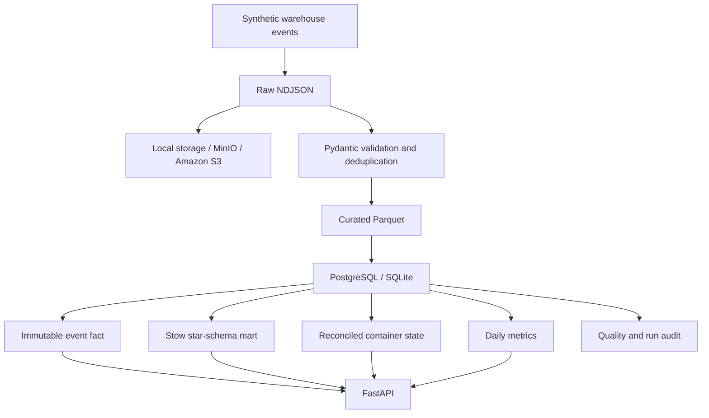

# Warehouse Intelligence Platform

A local-first data engineering project built around a realistic fulfilment problem: operational events arrive continuously, raw data needs to be preserved, bad records need to be caught, duplicate loads must not create duplicate facts, and the latest container state has to agree with the underlying event history.

The data in this repository is **100% synthetic**. It does not contain Amazon data, internal URLs, internal APIs, employee information or copied internal code.

## What it does

The project generates synthetic warehouse events, stores an immutable raw copy, validates and deduplicates records, writes curated Parquet, loads analytics tables, rebuilds current container state from event history, runs data-quality checks and exposes the results through FastAPI.



## Why I built it

I wanted a public project that reflects the type of operational data problems I enjoy working on without using company-confidential systems or data. The focus is reliability rather than just moving a CSV from one place to another.

A few things I deliberately built into it:

- idempotent batch loading using source checksums
- raw and curated data layers
- schema validation with Pydantic
- duplicate-event protection
- current-state reconciliation from immutable event history
- bounded retry logic for object-store I/O
- automated data-quality checks
- structured pipeline logs
- an audit table for every pipeline run
- FastAPI endpoints for operational metrics
- Docker Compose for PostgreSQL and S3-compatible MinIO
- GitHub Actions for linting, typing and tests
- optional Terraform for an AWS deployment path

## Quick demo, no cloud account needed

Python 3.11+ is required.

```bash
python -m venv .venv
source .venv/bin/activate   # Windows: .venv\Scripts\activate
pip install -e ".[dev]"
warehouse-platform demo --count 1000 --seed 42
```

The default demo uses SQLite plus local object storage, so it does not need Docker or AWS.

Example output:

```json
{
  "status": "success",
  "rows_loaded": 1000,
  "rejected_rows": 0,
  "summary": {
    "total_events": 1000,
    "active_containers": 125,
    "exception_rate": 0.053
  }
}
```

## Run with PostgreSQL and MinIO

```bash
docker compose up --build -d
```

Compose creates the MinIO bucket, runs one deterministic 1,000-event pipeline load, then starts the API. Running the command again against the same volumes is safe because the source batch is detected as a duplicate.

The stack exposes:

- API: `http://localhost:8000`
- PostgreSQL: `localhost:5432`
- MinIO API: `localhost:9000`
- MinIO console: `http://localhost:9001`

Create the MinIO bucket `warehouse-local` before running an S3-backed pipeline locally.

Useful API routes:

```text
GET /health
GET /metrics/summary
GET /metrics/daily
GET /containers/{container_id}
GET /quality/latest
```

## Repository layout

```text
src/warehouse_intelligence/
  api/                  FastAPI routes
  cli.py                command-line entry point
  config.py             environment settings
  database.py           warehouse tables
  models.py             validated event models
  pipeline.py           ingestion, transform, load and reconciliation
  storage.py            local and S3-compatible object storage
  synthetic.py          deterministic synthetic warehouse data

infrastructure/aws/     optional Terraform deployment
scripts/                helper scripts
sql/                    warehouse SQL examples
tests/                  automated tests
.github/workflows/      CI
```

## Data model

### `fact_warehouse_event`
Immutable validated events. This is the source of truth for historical warehouse activity.

### `dim_sku`, `dim_station`, `dim_associate` + `fact_stow_activity`
A small star-schema serving mart built from validated stow events. The fact table uses integer dimension keys while the raw event fact keeps the original synthetic business identifiers.

### `current_container_state`
One row per container. It is rebuilt from the event fact table so a partial or repeated load cannot silently drift current state away from event history.

### `daily_metrics`
A small serving mart for daily event volume, units, exception rate and active containers.

### `pipeline_runs` and `quality_results`
Operational metadata used to see what ran, what was loaded and whether the checks passed.

## Reliability decisions

### Idempotency
The SHA-256 checksum of each raw source file is stored in `pipeline_runs`. If the exact source is submitted again after a successful run, the pipeline returns the existing run rather than loading the facts twice.

### Reconciliation
Current container state is derived from the latest validated event for each container. I prefer rebuilding state from the fact history here because it makes the result deterministic and easy to verify.

### Retries
Object-store writes use small bounded retries. I intentionally did not add unlimited retry behaviour. A persistent failure should surface rather than sit in a loop pretending the pipeline is healthy.

### Data quality
Every run checks event ID uniqueness, quantity validity and rejected-row rate before it is marked successful.

## Tests and quality

```bash
make quality
```

This runs:

```text
ruff
mypy
pytest + coverage
```

CI runs the same checks on pushes and pull requests.

## AWS deployment path

The working project does **not** require AWS. The Terraform under `infrastructure/aws` provides the cloud equivalent using:

```text
ECR
ECS Fargate
Application Load Balancer
RDS PostgreSQL
S3
Secrets Manager
CloudWatch
EventBridge Scheduler
VPC / subnets / security groups
IAM
```

I have kept the AWS path separate from the local implementation on purpose. The local version can be reviewed and run without creating paid cloud resources.

**Do not run `terraform apply` casually. RDS, NAT Gateway, ALB and Fargate can generate AWS charges.**

See [infrastructure/aws/README.md](infrastructure/aws/README.md) for the deployment flow.

## Security and public-data note

This project is an independent portfolio implementation using synthetic data. It is not an Amazon system and does not expose or reproduce internal company endpoints, credentials, identifiers, warehouse configuration or employee data.

## Next improvements

The current version is deliberately focused. Sensible next steps would be event streaming with Redpanda/Kafka, a dbt serving layer and a small operational dashboard.
